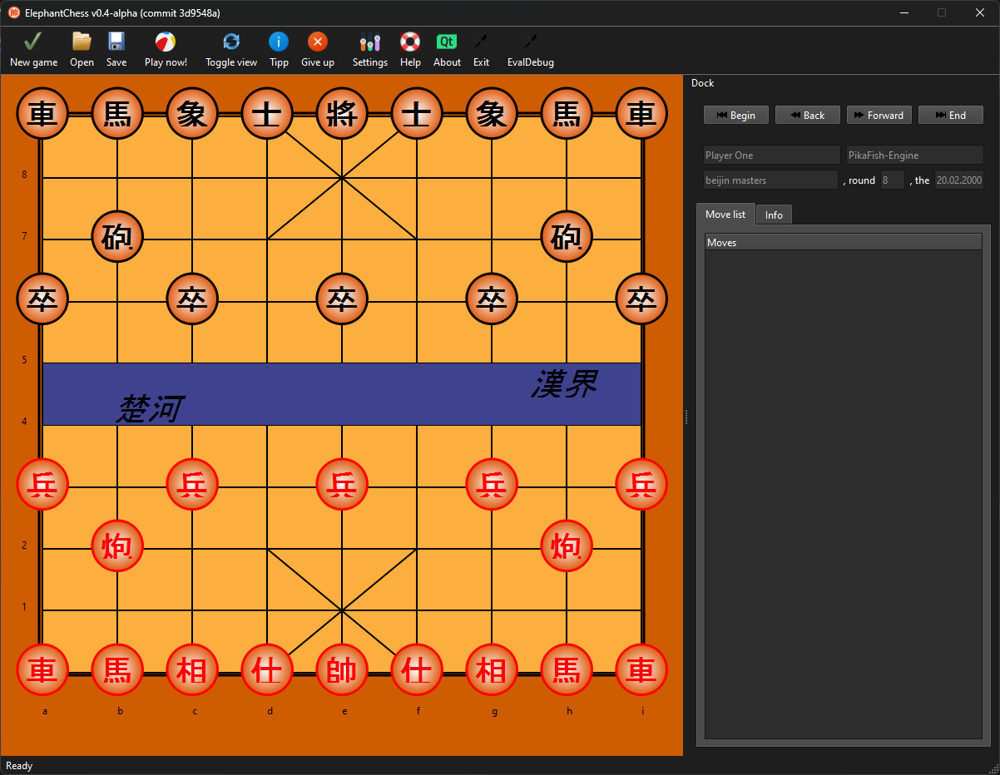

 

### Elephant Chess 

 
 

.::

::.

.::

:::

::.
<!--  -->

### Table of Contents
- [Introduction](#introduction)
- [Installation](#installation)
- [Rules](#rules)

### Introduction
ElephantChess is a Chinese Chess (Xiangqi) GUI application designed to play and analyze games, similar to how "Arena" functions for European Chess. Inspired by the commercial "Fritz" software, it's currently in a pre-alpha stage and features a basic AI opponent (weakbot).

- [Learn about Xiangqi on Wikipedia](https://en.wikipedia.org/wiki/Xiangqi)
- [Learn about European Chess on Wikipedia](https://en.wikipedia.org/wiki/Chess)

### Installation
Download the zip file, extract it, and follow the installation instructions. Use [Stable](https://www.elephant-chess.com) or [Latest](https://github.com/global667/ElephantChess/releases/latest)
  
#### Compatibility
Should run on Windows, macOS, Linux and WSL.

### Rules
Xiangqi is played on a 9x10 board divided by a "river", with pieces positioned on intersections. The game involves two players, Red and Black, each equipped with a set of distinct pieces: one General, two Advisors, two Elephants, two Horses, two Chariots, two Cannons, and five Soldiers.

#### Objective
The primary goal is to checkmate the opponent's General.

#### Gameplay Rules
- **將/帥 (Jiàng/Shuài) - General/King**: Moves one point orthogonally within the palace, a specific 3x3 region. 將 (Jiàng) is used by the black side. 帥 (Shuài) is used by the red side.
- **士 (Shì) - Guard/Advisor**: Moves one point diagonally, remaining within the palace. Sometimes also translated as "Mandarin."
- **象/相 (Xiàng) - Elephant**: Moves two points diagonally, cannot cross the river. 象 (Xiàng) is used by the black side. 相 (Xiàng) is used by the red side. Known as "Minister" in some English descriptions.
- **馬 (Mǎ) - Horse**: Moves in an “L” shape, can be blocked by other pieces.
- **車 (Jū) - Chariot/Rook**: Moves any number of points along a row or column.
- **炮/砲 (Pào) - Cannon**: Moves like the Chariot but must jump over one piece to capture another. Both 炮 and 砲 are used, depending on the regional writing system (simplified vs. traditional).
- **卒/兵 (Zú/Bīng) - Soldier/Pawn**: Moves one point forward; after crossing the river, it can also move sideways. 卒 (Zú) is used by the black side. 兵 (Bīng) is used by the red side.

Players take turns, with each move aiming to threaten the opponent's General. The game concludes by checkmate or stalemate, the latter occurring if a player cannot make a legal move and their General is not in check.

(TBD - Include information on how to use ElephantChess, covering any initial setup steps, basic commands, and options for gameplay.)

