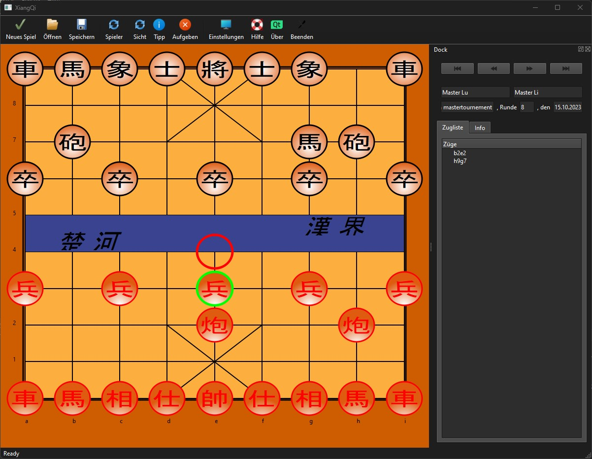

# ElephantChess

Chinese chess GUI with randombot and in pre alpha stadium...

The aim is to play and analyse games for Chinese Chess like with "Arena" 
for Europe Chess (with the commercial "Fritz" in mind).

- Chinese Chess on Wikipedia: <a href="https://en.wikipedia.org/wiki/Xiangqi">XiangQi</a>
- Europe Chess on Wikipedia: <a href="https://en.wikipedia.org/wiki/Chess">Chess</a>

## Installation
### Use QtCreator
- Go to https://www.qt.io/download-open-source and login
- Download Qt6.6 for Linux with "Qt Online Installer"
- Import repo in QtCreator or use
> `git clone https://github.com/global667/ElephantChess.git`
- Run `CMakeLists.txt` on QtCreator
### Use Debian package
> `wget https://github.com/global667/ElephantChess/releases/download/v0.4.0/elephantchess-0.4.0.deb`

> `sudo apt install ./elephantchess-0.4.0.deb`

> run `/usr/share/elephantchess/ElephantChess`

## Issues
- Should run on Windows and macOS too
- Tested on Ubuntu/wsl
- Have fun!

